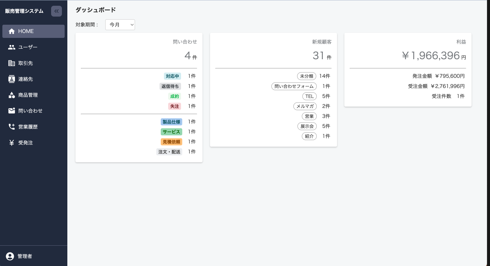

# 販売管理システム

PHP8.2/Laravel10, Reactを使って開発して、販売管理システムです。

公開URL:

## システム概要 💻

顧客管理から受発注管理に至るまで、会社の主要な業務フローをシームレスに一元管理するための基幹システムです。受注と発注を一対一で紐づけることができ、案件ごとに粗利益を管理できることが特徴です。そのため、在庫を持たずに運営する商社や、ドロップシッピングを行う企業にとって、業務の効率化と収益性の向上を実現する理想的な管理ツールとなります。

### なぜ開発したか？

営業として入社した現職で、自分の手で社内業務の改善を行い営業成績を上げたいと思ったことがきっかけです。

現職に入社当初は、取引先や売上情報がExcel帳票で管理されており非効率かつデータの活用が困難な状態でした。新卒で入社した会社では大規模な基幹システムを使用した経験があるため、どのような運用・管理をすれば良いかの大まかな完成イメージはありました。それを実現しようとした時、プログラミング未経験だった自分がすぐにできそうな手段としてMS Access/VBAを選び社内システム第一弾を完成させました。その後、社内からのフィードバックを反映して機能拡張やUI/UXを向上させるためにWebシステム化することを決め、PHP/Laravelを学習しながら第二弾を完成させました。そして、保守・メンテナンス性を向上させること、さらなるUI/UX向上を目的にReactを使って第三弾（本システム）に至りました。

### 主要機能概要

- ユーザー: システムユーザー（社員）の登録、権限設定、退職者管理
- 取引先: 仕入先、販売先の基本情報を管理（法人・個人含む）
- 連絡先: 取引先に所属する顧客（連絡先）単位で管理
- 請求先: 取引先に対する請求窓口を管理（会計ソフトとのAPI連携を想定）
- 配送住所: 取引先に紐づく納品先/出荷地等の住所を管理
- 受発注: 受注と発注を紐付けて一元管理
- 問い合わせ: 顧客からの問い合わせ、それに対する対応履歴を管理
- 営業履歴: 顧客に対してこちらからアプローチをかけた履歴

## 技術・システム構成 ⚙️

### 環境

開発環境構築・システムのインストール手順は長くなるため以下を参照ください。

- [環境構築](/src/docs/installation.md)

### テーブル定義

以下を参照ください。

- [テーブル定義](/src/docs/tables-definition.md)

### ER図

## 工夫した点 💡

### アプリ・UI/UX

### 開発・技術

1. Gitコミットメッセージ
  コミットメッセージは[AngularJS](https://github.com/angular/angular.js/blob/master/DEVELOPERS.md#type)のPrefixルールを取り入れ、`feat:`や`refactor:`など一目で分かりやすくなるようにしました。
2. コミットの粒度を意識
  Prefixルールに沿うだけでもある程度自然にできますが、コミットの際は「関係のある変更だけ」「レビューされる時に分かりやすい」を意識しました。
3. コーディング規約
  これは完全に出来ている訳ではなく一部ですが。
