# Flagship 🚩

顧客管理から受発注管理に至るまで、会社の主要な業務フローを一元管理するための基幹システムです。

公開URL: [https://app.rz-log.com/demo](https://app.rz-log.com/demo)
（ゲストユーザーとして自動ログインできます）

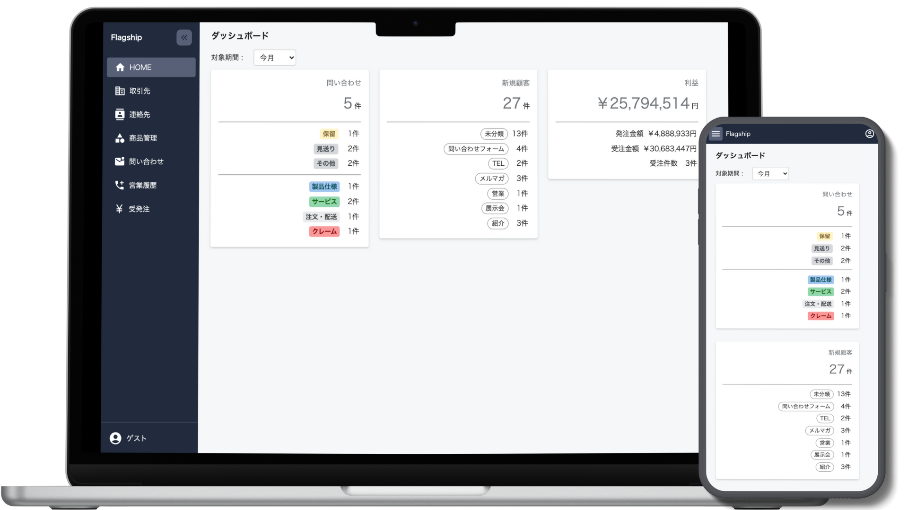

## アプリ概要 💻

### 特徴

受注と発注を一対一で紐づけることができ、案件ごとに粗利益を管理ができます。そのため、在庫を持たずに運営する商社やドロップシッピングを行う企業の業務フローにマッチしています。

### 開発の背景

私は現在、物流系の商材を販売する商社に勤めています。入社当初は販売履歴がExcelで管理されており、販売先/仕入先や配送情報は正規化されずベタ打ちの状態でした。過去のデータを元に営業活動をしたりデータ集計・分析したりすることはもはや困難。取引先や問い合わせ対応の管理も全て異なる帳票・Excelで行われており、データ参照・入力に無駄や非効率さがありました。

そこで、作業を効率化しデータを有効活用できる状態にすることで営業成績を伸ばしたいと思い、自社業務を一元管理できるシステムを個人開発しました。

### 主要機能概要

- ユーザー: ユーザー(社員)の登録、権限設定、退職者管理
- 取引先: 仕入先、販売先の基本情報を管理（法人・個人含む）
- 連絡先: 取引先に所属する連絡先(顧客)単位で管理
- リード：取引先・連絡先(顧客)の獲得元・由来を管理
- 請求先: 取引先に対する請求窓口を管理（会計ソフトとのAPI連携を想定）
- 配送住所: 取引先に紐づく納品先/出荷地等の住所を管理
- 受発注: 受注と発注を紐付けて一元管理
- 問い合わせ: 顧客からの問い合わせ、それに対する対応履歴を管理
- 営業履歴: 顧客に対してこちらからアプローチをかけた履歴

## 技術・システム構成 ⚙️

- PHP 8.2.9
- Laravel 10.28
- React 18.2

インフラ:

- AWS(EC2, Route53)
- MySQL 8.0.36
- nginx 1.22.1
- Docker/Docker-compose(開発環境)

システムのインストール手順の詳細は以下を参照ください。

- [環境構築](/src/docs/installation.md)

### テーブル定義

以下を参照ください。

- [テーブル定義](/src/docs/tables-definition.md)

### ER図

### インフラ構成図

今回のポートフォリオ公開環境では、コストの関係でRDSは使わずEC2内にDBを置いています。

## 機能紹介

### 取引先

取引先の登録画面。基本情報と合わせて、この取引先に所属する連絡先と配送住所を複数同時登録が可能。

連絡先・配送情報の登録。

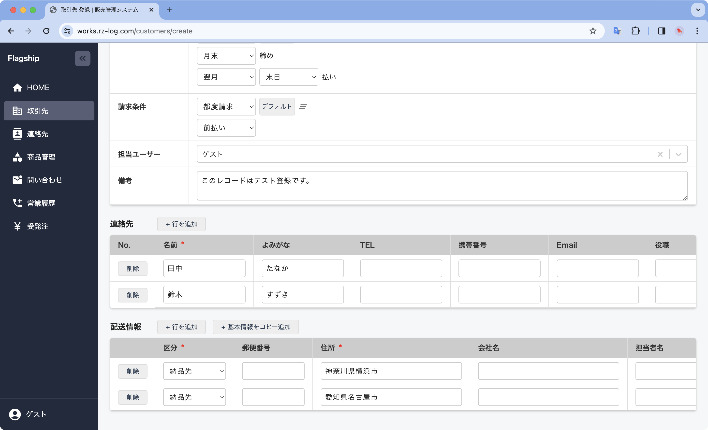

取引先に紐づく全ての情報・履歴が1画面から確認可能。顧客対応の属人化を防ぎます。

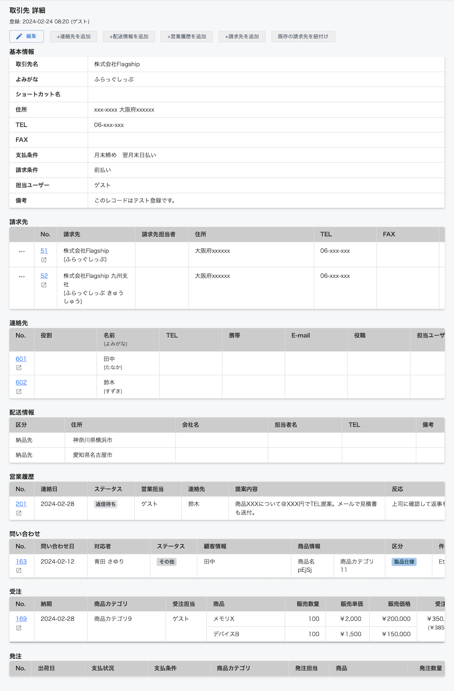

## 受発注

受発注一覧画面。受注案件ごとの販売・仕入情報、粗利益を管理可能。

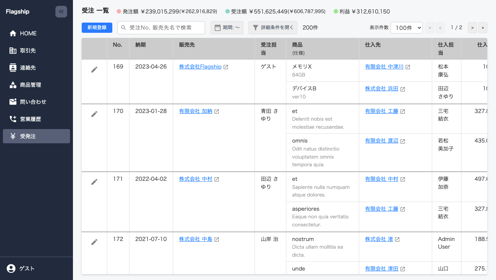

受注登録。

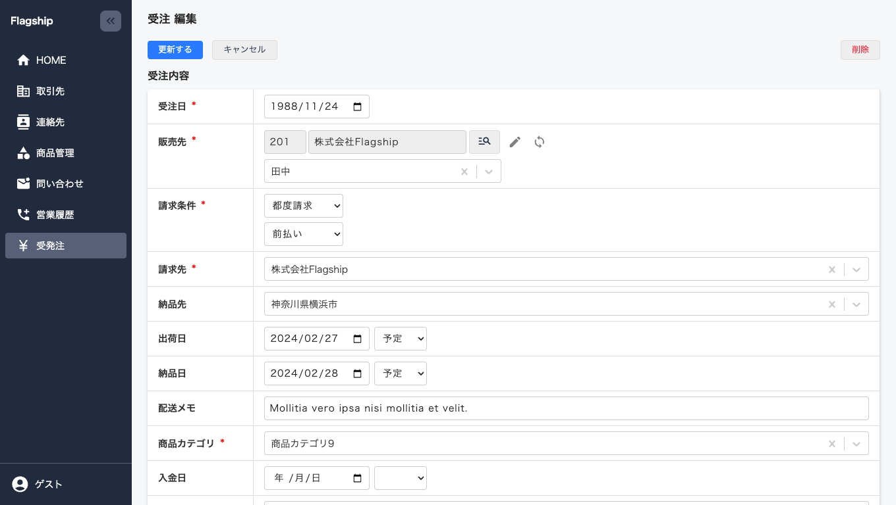

明細行で商品情報や紐づく発注情報を登録。同時受発注登録ができるため伝票の二重登録を防ぐことができます。

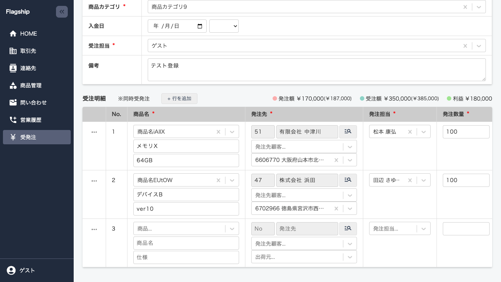

## 問い合わせ

問い合わせ一覧画面

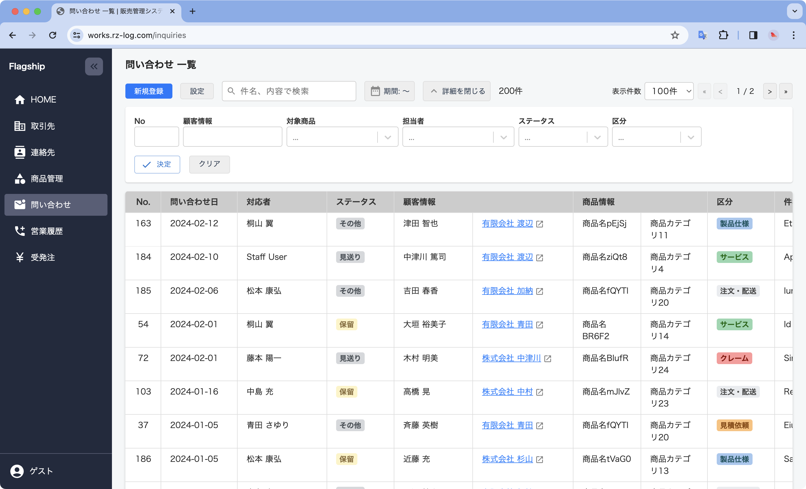

非同期で取引先/連絡先マスタから簡単に顧客情報を選択が可能。

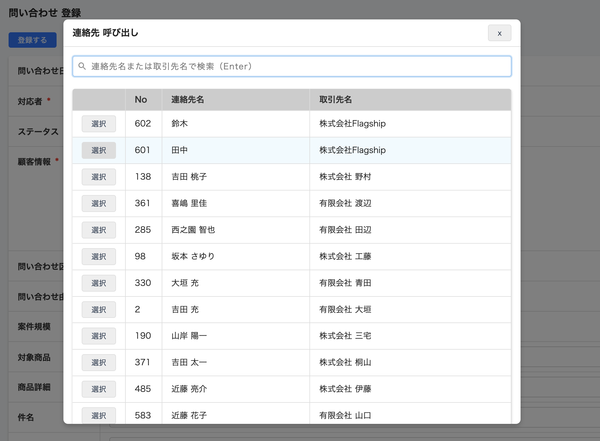

## 工夫した点 💡

### テーブル設計

拡張性・保守性が高くなるように、テーブルの役割分担・正規化/非正規化を考えました。

例：

- テーブルの役割分け
  - 仕入先と販売先を分けず取引先マスタで一括管理
  - 取引先ごとの「支払条件」を取引先マスタから支払条件マスタへ切り出し
- 正規化/非正規化
  - 取引先に対する支払条件や配送住所等は正規化
  - 受注マスタに対する支払条件や配送住所等は非正規化（過去データが変わらないように、登録時に参照のみ）

取引先と請求先の関係を柔軟に対応できるように、多対多リレーションにしました。

- 複数の販売先の請求先が同一の請求先（例：各支店が販売窓口になり、請求先は本社になる）
- 一つの販売先に対して複数の請求先が存在する（例：購入商品の種類によって、決済窓口が異なるケース）

税率をマスタ管理。税率を適用開始日・終了日とともに保存し、適切な税率が自動で選択させる仕組みにしました。これにより、変更予約が可能になるため、税率が変更になる際直前にコードを修正することはなくなります。

### UI/UX

#### マスタ呼び出しの非同期処理

データ登録の際は別のマスタデータを参照することが多いため、モーダルの検索画面から非同期で参照したいデータを簡単に選択できるようにしました。

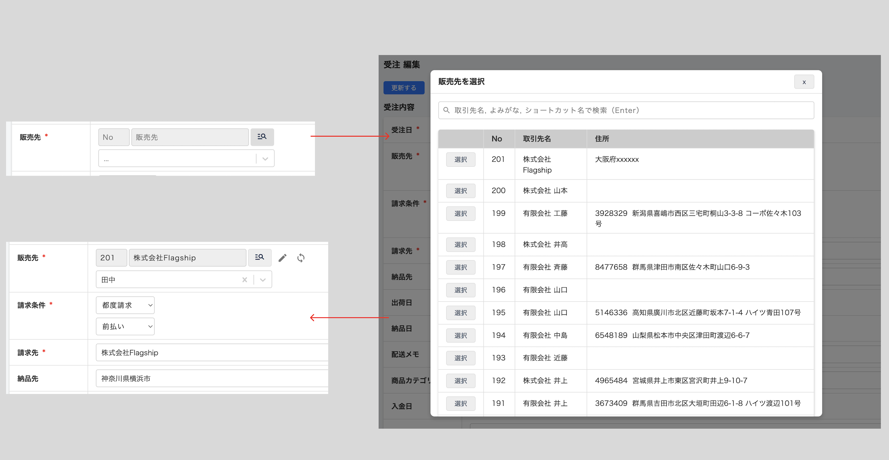

#### 問い合わせ区分のカスタマイズ

問い合わせの管理では「区分」を選択することが可能です。区分は使用ユーザーによって変わったり業務フローの見直しで更新される可能性を考え、ユーザーでカスタムできる設計にしました。

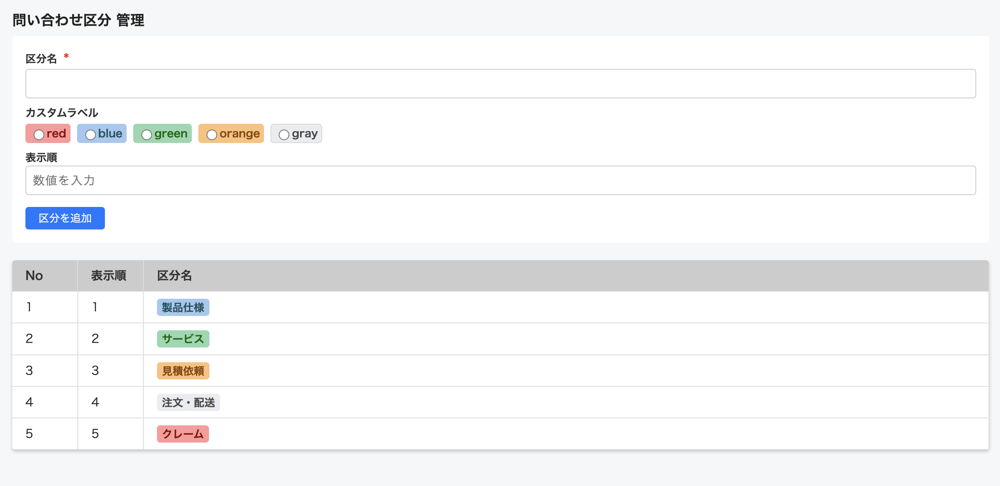

#### レスポンシブ対応

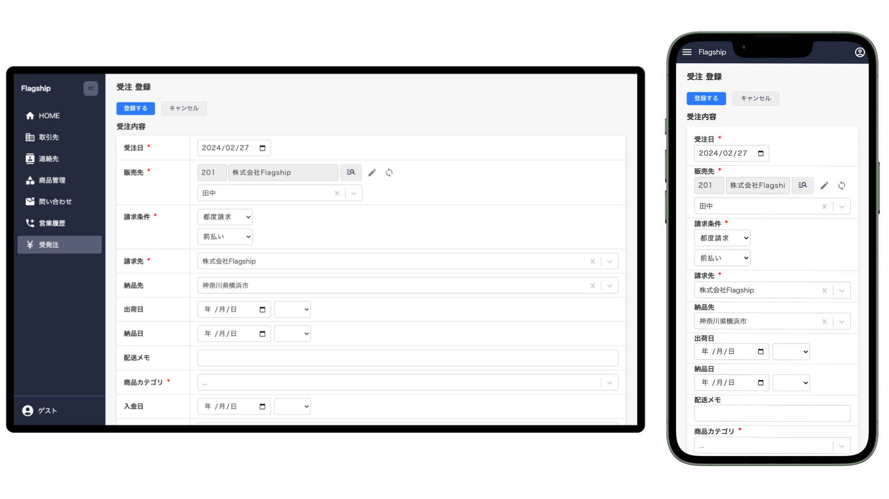

#### 商品登録

商品登録では、`カテゴリグループ > カテゴリ > 商品`という3階層になるため、できるだけ簡単に入力できるよう1画面で登録ができるようにしました。

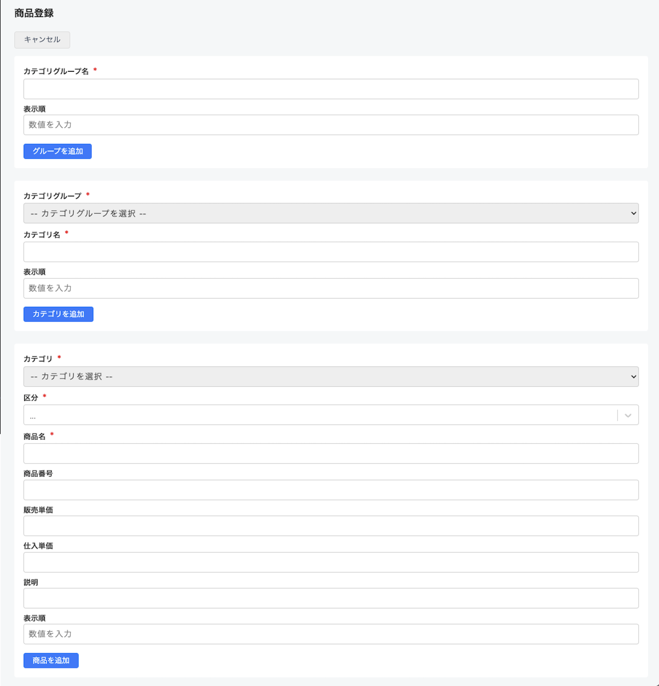

#### 期間選択ピッカー

日付範囲を指定して絞り込むことが多いため、ワンタッチで簡単に検索できるように期間選択が可能。

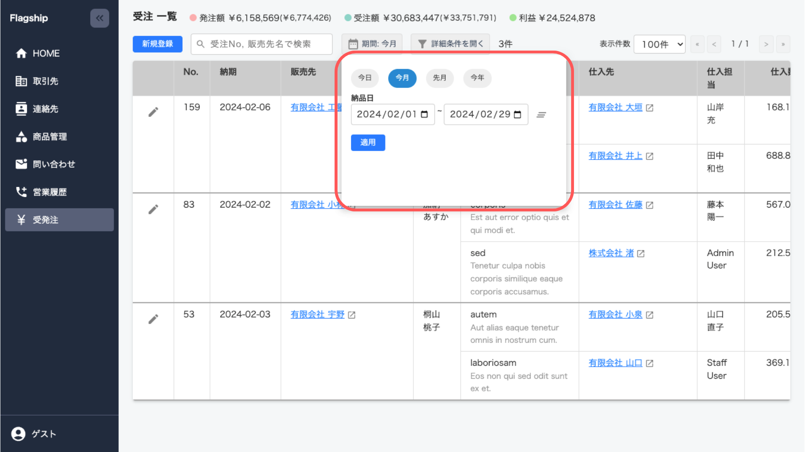

### 開発フロー

1. Gitコミットメッセージ

    コミットメッセージは[AngularJS](https://github.com/angular/angular.js/blob/master/DEVELOPERS.md#type)のPrefixルールを取り入れ、`feat:`や`refactor:`など一目で分かりやすくなるようにしました。

2. コミットの粒度を意識

    Prefixルールに沿うだけでもある程度自然にできますが、コミットの際は「関係のある変更だけ」「レビューされる時に分かりやすい」を意識しました。

3. チーム開発を意識

    基本的にはGitHubフローを参考にブランチを切りpush, PR, マージという運用で開発を進めました。

4. コーディング規約（一部ですが）

    バックエンドではPRS-12、フロントはGoogle HTML/CSS Style Guideなどを参考に。ESLintでReactのインポート順の整理やEditorConfigでインデントルールを自動統一しました。

## 今後の課題

- 会計ソフトとのAPI連携

  本アプリで販売管理が可能になりましたが、まだ経理部門で会計ソフトへの二重入力や入金の消し込み作業を目視で行うなど非効率な部分が残っています。それを解消するために、API連携で請求先マスタの同期、目視照合作業の自動化の開発を進めます。

- 見積作成機能

  必要事項を入力すると雛形に合わせて見積書を自動で作成し、取引先・問合せ・受注マスタと紐づけた履歴管理をできるようにします。

以上。
