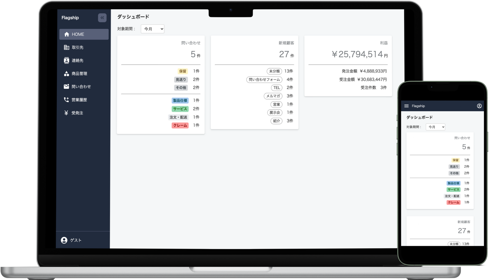
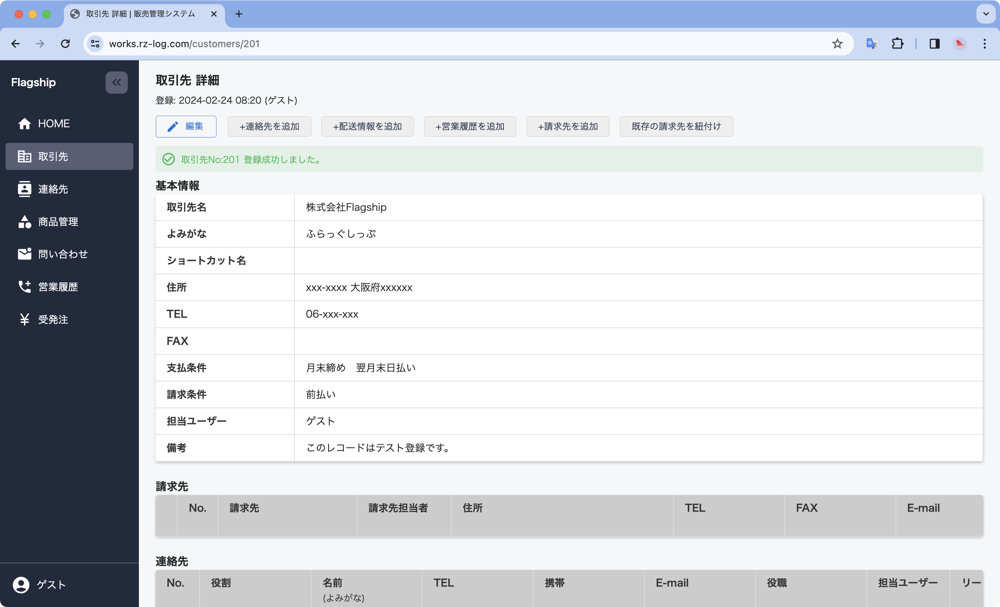
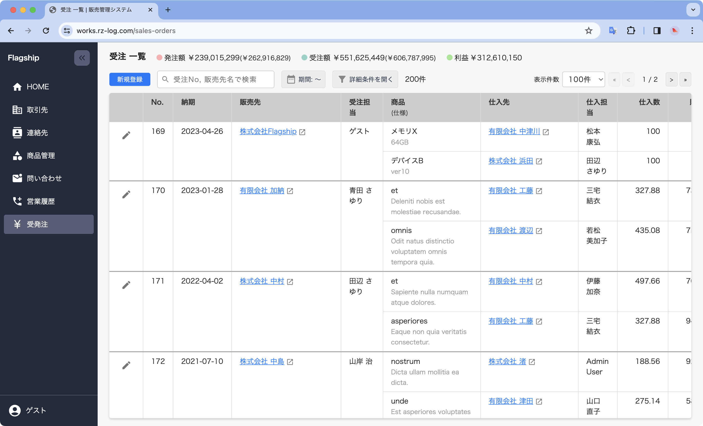
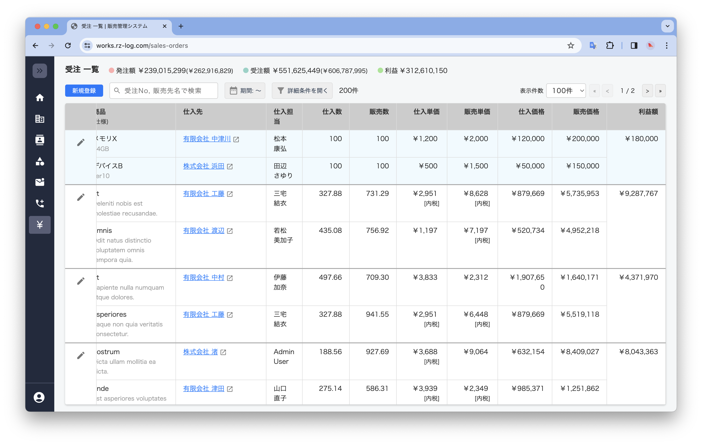
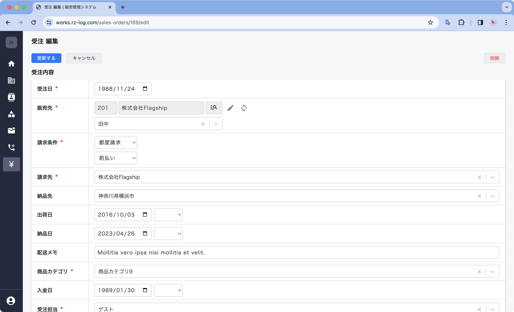
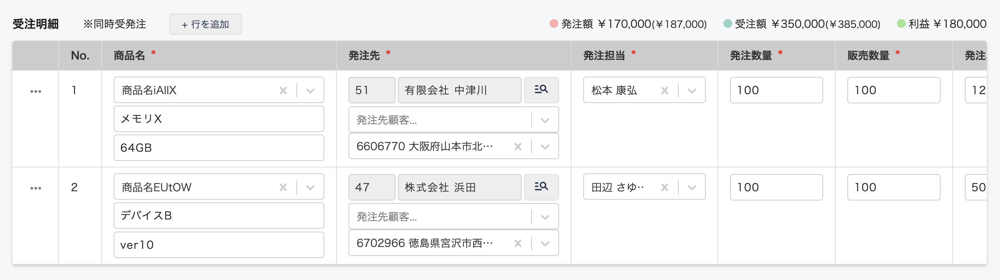
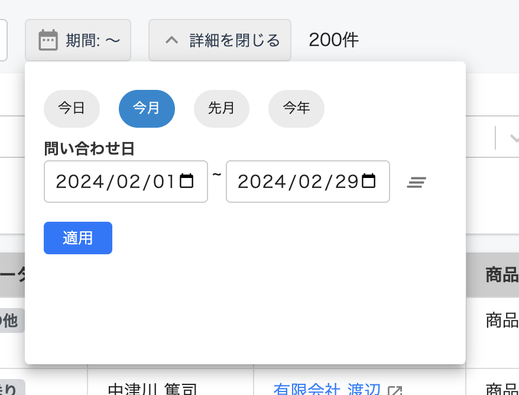
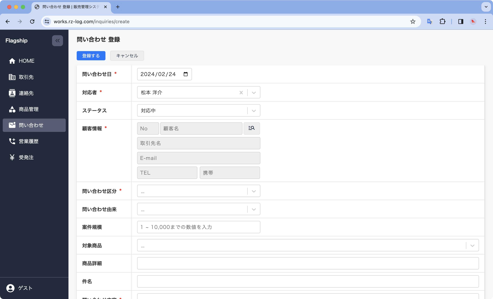
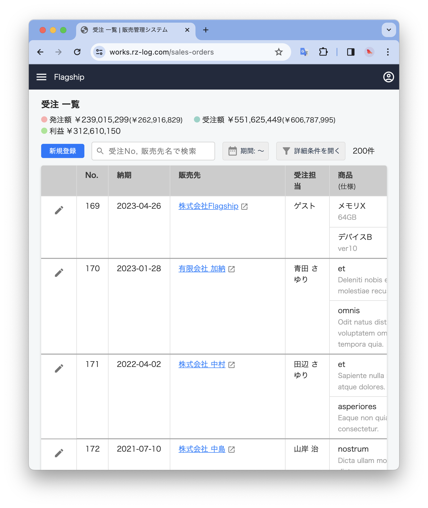
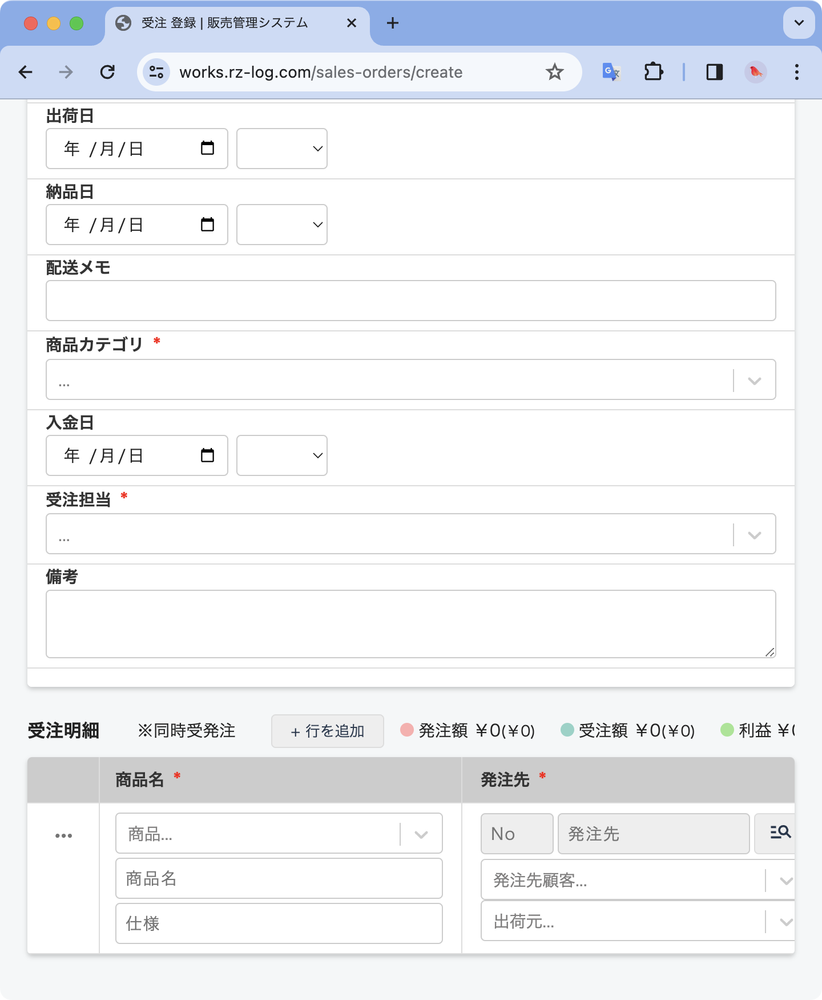

# Flagship 🚩

公開URL: [https://works.rz-log.com/demo](https://works.rz-log.com/demo)

## アプリ概要 💻

顧客管理から受発注管理に至るまで、会社の主要な業務フローを一元管理するための基幹システムです。

### 特徴

受注と発注を一対一で紐づけることができ、案件ごとに粗利益を管理ができます。そのため、在庫を持たずに運営する商社やドロップシッピングを行う企業の業務フローにマッチしています。

### なぜ開発したか？

営業として入社した現職で、自分の手で社内業務の改善を行い営業成績を上げたいと思ったことがきっかけです。

現職に入社当初は、取引先や売上情報がExcel帳票で管理されており非効率かつデータの活用が困難な状態でした。新卒で入社した会社では大規模な基幹システムを使用した経験があるため、どのような運用・管理をすれば良いかの大まかな完成イメージはありました。それを実現しようとした時、プログラミング未経験だった自分がすぐにできそうな手段としてMS Access/VBAを選び社内システム第一弾を完成させました。その後、社内からのフィードバックを反映して機能拡張やUI/UXを向上させるためにWebシステム化することを決め、PHP/Laravelを学習しながら第二弾を完成させました。そして、保守・メンテナンス性を向上させること、さらなるUI/UX向上を目的にReactを使って第三弾（本システム）に至りました。

### 主要機能概要

- ユーザー: システムユーザー（社員）の登録、権限設定、退職者管理
- 取引先: 仕入先、販売先の基本情報を管理（法人・個人含む）
- 連絡先: 取引先に所属する顧客（連絡先）単位で管理
- リード：取引先・顧客(連絡先)の獲得元・由来を管理
- 請求先: 取引先に対する請求窓口を管理（会計ソフトとのAPI連携を想定）
- 配送住所: 取引先に紐づく納品先/出荷地等の住所を管理
- 受発注: 受注と発注を紐付けて一元管理
- 問い合わせ: 顧客からの問い合わせ、それに対する対応履歴を管理
- 営業履歴: 顧客に対してこちらからアプローチをかけた履歴

## 技術・システム構成 ⚙️

- PHP 8.2.9
- Laravel 10.28
- React 18.2

インフラ:

- AWS(EC2, Route53)
- MySQL 8.0.36
- nginx 1.22.1
- Docker/Docker-compose(開発環境)

システムのインストール手順の詳細は以下を参照ください。

- [環境構築](/src/docs/installation.md)

### テーブル定義

以下を参照ください。

- [テーブル定義](/src/docs/tables-definition.md)

### ER図

### インフラ構成図

今回コストの関係でRDSは使わずEC2内にDBを置いています。

## 機能紹介

### 取引先

取引先の登録画面。基本情報と合わせて、この取引先に所属する連絡先と配送住所を複数同時登録が可能。

連絡先・配送情報の登録。

登録した取引先画面から簡単に関連データを追加することが可能。（連絡先、配送情報、営業履歴、請求情報）

## 受発注

受発注一覧では案件ごとの販売/仕入情報が一目で分かるレイアウト。

テーブルを横スクロールで詳細情報まで確認。

受注登録画面

受注明細行を登録

## 問い合わせ

問い合わせ一覧画面

期間の検索も簡単に

問い合わせ登録画面

非同期で取引先/連絡先マスタから簡単に顧客情報を選択が可能。

## 工夫した点 💡

### 設計

取引先と請求先の関係を柔軟に対応できるように、多対多リレーションにしました。

- 複数の販売先の請求先が同一の請求先（例：各支店が販売窓口になり、請求先は本社になる）
- 一つの販売先に対して複数の請求先が存在する（例：購入商品の種類によって、決済窓口が異なるケース）

問い合わせの管理では「区分」を選択することが可能です。区分は使用ユーザーによって変わったり業務フローの見直しで更新される可能性を考え、ユーザーでカスタムできる設計にしました。

### 開発・技術

1. Gitコミットメッセージ
  コミットメッセージは[AngularJS](https://github.com/angular/angular.js/blob/master/DEVELOPERS.md#type)のPrefixルールを取り入れ、`feat:`や`refactor:`など一目で分かりやすくなるようにしました。
2. コミットの粒度を意識
  Prefixルールに沿うだけでもある程度自然にできますが、コミットの際は「関係のある変更だけ」「レビューされる時に分かりやすい」を意識しました。
3. チーム開発を意識
  基本的にはGitHubフローを参考にブランチを切りpush, PR, マージという運用で開発を進めました。
4. コーディング規約（これは完全に出来ている訳ではなく一部ですが）
  バックエンドではPRS-12、フロントはGoogle HTML/CSS Style Guideなどを参考に。ESLintでReactのインポート順の整理やEditorConfigでインデントルールを自動統一しました。

### アプリ・UI/UX

#### 非同期処理

データ登録の際は別のマスタデータを参照することが多いため、モーダルの検索画面から非同期で参照したいデータを簡単に選択できるようにしました。

#### レスポンシブ対応

一覧画面

登録画面

