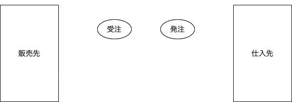

# sales-manager-plus

【WIP】以下、アプリ仕様メモです。

## ER

## ビジネスフロー

自社で在庫を持たないビジネスモデル。販売先からの受注に対応する発注を都度行い、商品は仕入先から販売先へ直送する。

## アプリ仕様

### 権限 permissions

Relationship:

- HasMany `users`

デフォルトの権限は次の3種類:

| ID | 権限名         | 表示名          |
|----|----------------|-----------------|
| 1  | `system-admin` | システム管理者  |
| 2  | `admin`        | 管理者          |
| 3  | `staff`        | 担当者          |

### ユーザー users

Relationship:

- BelongsTo `permissions`
- HasMany `customers`
- HasMany `customer_contacts`

| メソッド名 | 概要          | 権限制御       |
|------------|---------------|----------------|
| `index`    | 一覧表示      | なし           |
| `create`   | 登録画面表示  | `admin`以上    |
| `store`    | 保存          | `admin`以上    |
| `edit`     | 編集画面表示  | `admin`以上    |
| `update`   | 更新          | `admin`以上    |

### 取引先 customers

Relationship:

- BelongsTo `users`
- HasMany `customer_contacts`

| メソッド名 | 概要          | 権限制御       |
|------------|---------------|----------------|
| `index`    | 一覧表示      | なし           |
| `create`   | 登録表示      | なし           |
| `store`    | 保存          | なし           |
| `show`     | 詳細表示      | なし           |
| `edit`     | 編集表示      | なし           |
| `update`   | 更新          | なし           |
| `destroy`  | 削除          | なし           |

### 取引先担当者 customer_contacts

Relationship:

- BelongsTo `users`
- BelongsTo `customers`
